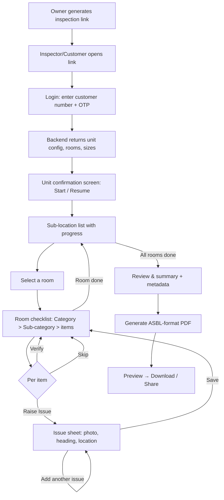

# ASBL Handover Inspection App — PRD & UX Flow

**Owner:** Kunal (Product / Tech, ASBL)
**Status:** Draft v1 — for Claude Design prototyping → development handoff
**Scope:** Handover *inspection* only — **Phase 03 (Site Visit & Inspection)** of the broader handover journey; the `Inspection Assigned → Joint Inspection → Issues Raised?` segment
**Target output:** Auto-generated PDF in ASBL format (matching the A-905 "Handover Inspection Report" style)

---

## 1. Problem & goal

### Today's flow (manual, multi-hop)
```
3rd-party inspector inspects unit
        ↓  (report in inspector's own format, e.g. ReNEWvation)
ASBL team member re-verifies + re-keys the data
        ↓  (manual entry into progress system)
Progress system generates PDF in ASBL format
```
Every arrow above is a manual intervention: re-formatting, re-verification, re-keying. It's slow, error-prone, and format-dependent on whichever vendor did the inspection.

### Target flow (single app)
```
Owner shares an inspection link  →  Inspector (or customer) logs in with customer number
        ↓
Unit auto-loads (config + rooms + sizes)  →  Guided room-by-room checklist
        ↓
Each item: Verify / Raise Issue / Skip  →  Issues captured with photo + location inline
        ↓
Submit  →  ASBL-format PDF generated automatically (MVP: auto-final)
```

### Primary goals
- One standardized checklist and one output format, regardless of who inspects.
- Eliminate re-keying and re-verification for the inspection step.
- Data captured at source, in structured form (so a future API write-back to the progress system is trivial).
- Same tool works whether a **third-party inspector** or the **customer themselves** does the inspection.

### Non-goals (MVP)
- Issue *resolution* tracking / rectification workflow (inspection only).
- Writing back into the progress system via API (PDF output only for now; data model must not preclude it later).
- ASBL-side review/approval gate (MVP submit = auto-final).
- Replacing the broader handover journey (only the inspection stage is in scope).

### Where this fits in the handover journey
The full ASBL handover spans four phases across three systems (Progress → CRM → Manage): **01 Flat Readiness & QC → 02 Scheduling & Preparation → 03 Site Visit & Inspection → 04 Post-Handover Living.**

**This app is Phase 03**, specifically the segment: `Inspection Assigned → Joint Inspection → Issues Raised?`

```
[Progress] Handover Ready ──► [CRM] Slot Booking / Slot Booked ──► [Manage] Housekeeping
                                        │
                                        ▼
        Site Visit & QR check-in  ──►  Inspection Assigned  ──►  ★ THIS APP ★  ──►  Issues Raised?
        (customer, safety checklist)   (registered vendor link         │              │ No → loop
                                        or in-house FM exec)     PDF of issues        │ Yes ▼
                                                                       ▼        [CRM] Issue Resolution
                                                                 hands to →      & Consent (rectify /
                                                                                 can't-rectify, digital
                                                                                 consent) ──► Customer
                                                                                 Accepts Handover
                                                                                 (acceptance letter + e-sign)
```

Key consequences of this position (detailed in later sections):
- **Joint walk.** Inspection is usually customer + third-party inspector + **FM executive** together — not inspector-alone. The FM executive maps to the A-905 PDF's "Handover Executive".
- **Two entry paths.** Registered vendors get an **inspection link** (customer-number + OTP login); customers enter via **QR check-in at the flat**, which also runs a safety/awareness (helmet/vest) step and gates on flat status = *Handover Ready*.
- **Registered-vendor list.** Only verified vendors get links; a walk-in with a non-registered vendor is a known failure point → routed to an in-house FM executive.
- **Downstream handoff.** The generated PDF / issue set is the input to CRM *Issue Resolution & Consent* and ultimately *Customer Accepts Handover*. Re-inspection loops back through slot booking (future delta-report need).
- **Strategic:** the journey has an open question — *"should the 3rd-party checklist match the internal Project QC checklist (Phase 01)?"* This PRD's answer: **yes, one shared master checklist** (§5), so QC and handover inspection are directly comparable.

---

## 2. Users & roles

Inspection is typically a **joint walk** (customer + inspector + FM executive together), so more than one role is often present in a single session. The app tracks *who conducted* the inspection and captures the relevant identities for the PDF.

| Role | Who | What they do |
|---|---|---|
| **Third-party inspector** | Engineer from a **registered/verified vendor** (e.g. ReNEWvation) | Receives the inspection link, logs in with customer number + OTP, operates the guided inspection, submits → PDF. Maps to PDF "Inspected by (Engineer)". |
| **FM executive** | In-house ASBL executive | Present on the joint walk; operates the inspection directly when there is **no registered vendor**. Maps to PDF "Handover Executive". |
| **Customer** | The homebuyer | Enters via **QR check-in** at the flat; can inspect their own unit (self-inspect) and co-signs at the end. |
| **Owner / ASBL admin** | ASBL handover team | Maintains the registered-vendor list & master checklist, generates/shares inspection links, views submitted reports. (Admin UI can be light in MVP.) |

**Mode is set by entry context, not by the user choosing:**
- **Inspector link** (bound to a registered vendor) → inspector mode; captures inspector identity, feeds "Inspected by (Engineer)".
- **QR check-in** (customer at the flat) → customer/self-inspect mode; friendlier microcopy; customer identity auto-filled.
- **In-house** (no registered vendor) → FM-executive-operated; feeds "Handover Executive".

The checklist engine is identical across modes; differences are cosmetic (help text) plus which identity/signature fields are populated. All three parties may sign at the end (see §8 signature block).

---

## 3. Core concepts (glossary)

- **Unit** — the flat being inspected (project, tower, unit no, product/division, config, sqft, customer). Fetched from backend via customer number.
- **Sub-location** — a physical space inside the unit (Living, MBR, MBR-Toilet, Utility, Balcony…). Auto-generated from unit config. Mirrors the "Sub-Location" grouping in the ASBL PDF.
- **Checklist item** — a single "Check whether…" question (e.g. *Check for Hollowness observed in the tiling*). Belongs to a **Category → Sub-category**.
- **Category / Sub-category** — the two-level taxonomy shown in the PDF breadcrumb (e.g. *Flooring → Hollowness*, *Doors → Functionality*).
- **Item response** — one of `VERIFIED` / `ISSUE` / `SKIPPED` for a checklist item in a given sub-location.
- **Issue** — a raised defect: photo(s) + heading + exact location + sub-location + category/sub-category. One checklist item can produce **multiple** issues (the A-905 report shows the same check raised several times per room).
- **Inspection session** — one full pass over a unit, from login to submit → PDF.

---

## 4. End-to-end flow



---

## 5. Master checklist taxonomy

This is the single source of truth every inspection uses. ASBL owns and maintains it. Each item carries an **applicability tag** so the engine only shows items relevant to a room type. Derived as a superset of both the ReNEWvation (B-3805) and ASBL (A-905) reports.

**Applicability tags:** `ALL` (any room), `DRY` (living/dining/bedrooms), `WET` (toilets), `KITCHEN`, `UTILITY`, `BALCONY`, `EXTERNAL/COMMON`, `ENTRANCE`.

| Category | Sub-category | Checklist item (question) | Applies to |
|---|---|---|---|
| Doors | Functionality | Check whether the door stopper & handle work properly | ALL (rooms with doors) |
| Doors | Locking | Check the functioning of door locking | ALL |
| Doors | Magnetic stopper | Check the magnetic door stopper functioning (stopper hitting wall) | ALL |
| Doors | Frame | Check door frame for chips/cracks | ALL |
| Doors | Shutter | Check door shutter for edge damage | ALL |
| Windows | Functionality | Check window locking & ease of operation | DRY, KITCHEN, WET, UTILITY |
| Windows | Frame/Glass | Check window frame/glass for scratches, cracks, noise | DRY, KITCHEN |
| Flooring | Hollowness | Check for hollowness in the tiling (>25% = replacement) | ALL |
| Flooring | Chip-offs | Check for chip-offs in the tiling | ALL |
| Flooring | Scratches | Check for scratches over the tiling | ALL |
| Flooring | Cracks | Check for cracks in the tiling | ALL |
| Flooring | Grouting | Check tile grouting application | ALL |
| Flooring | Undulations/Alignment | Check for undulations / joint alignment in tiling | ALL |
| Flooring | Slope | Check for slope (water flow) in the tiling | WET, UTILITY, BALCONY |
| Flooring | Bend/Leveling | Check for bent tiles needing leveling/replacement | ALL |
| Walls & Painting | Finishing | Check for edge undulations / bubbles on the wall | ALL |
| Walls & Painting | Cracks/Putty | Check walls for cracks / putty work | ALL |
| Walls & Painting | Seepage | Check for seepage / wet marks (walls & slab/ceiling) | ALL |
| Walls & Painting | Unevenness | Check wall unevenness (sliding top / arch height) | ALL |
| Walls & Painting | Bore packing | Check bore packing around AC pipe | DRY |
| Electrical | Functioning | Check functioning of switches & fixtures | ALL |
| Electrical | Alignment | Check alignment/leveling of switchboard face plates | ALL |
| Electrical | Doorbell plate | Check doorbell face plate clean & aligned | ENTRANCE |
| Electrical | AC point/wire | Check AC point & AC wire provision | DRY |
| Plumbing | Pressure/Supply | Check shower/diverter/spout & commode for water supply, pressure, flow | WET |
| Plumbing | Alignment | Check shower head/diverter/bath spout fixed & aligned; washbasin tap fitting | WET |
| Plumbing | Housekeeping | Check floor traps free of dust/foam/plastic; no clogging | WET, UTILITY |
| Plumbing | Leakages | Check taps / drains / washbasin / showers for leaks | WET, KITCHEN |
| Granite/Stone | Damage | Check granite for cracks / damage / scratches | WET, KITCHEN, BALCONY |
| Granite/Stone | Finishing | Check granite-to-wall grouting/finishing | WET, KITCHEN, BALCONY |
| Skirting | Condition | Check skirting for chip-off / finishing / grouting | ALL |
| Kitchen | Gas pipeline | Check finishing around gas pipeline area | KITCHEN, UTILITY |
| Kitchen | Exhaust fan | Check exhaust fan finishing | KITCHEN, WET |
| Balcony | Ceiling/Joints | Check balcony ceiling (gypsum), cement joint finishing | BALCONY |
| Fittings/Provisions | Presence | Verify presence: gas meter, mirror, tower bolts, locks/handles/stoppers, geyser point, AC duct, recharge meter, gas leak detector | ALL / as applicable |
| Cleaning | Deep clean | Note deep-cleaning suggestions (windows, switchboards) | ALL |

> **Design note:** The master checklist must be **admin-editable** (add/edit/retire items, set applicability). MVP can ship with the above seeded; a lightweight admin editor can come in v1.1.

---

## 6. Sub-location (room) model

Rooms are **auto-generated from the unit config** returned at login (confirmed: backend can provide configuration, room layout, and sizes).

Each generated sub-location has a **room type** that drives which checklist items appear:

| Room type | Example labels | Checklist applicability |
|---|---|---|
| Entrance | Entrance / Foyer | ENTRANCE + door items |
| Living | Living | DRY |
| Dining | Dining | DRY |
| Bedroom | MBR / GBR / KBR / Bedroom-1/2 | DRY (+ dressing sub-space if present) |
| Toilet | MBR-Toilet / GBR-Toilet / KBR-Toilet / Common Washroom | WET |
| Kitchen | Kitchen | KITCHEN |
| Utility | Utility | UTILITY |
| Balcony | Common Balcony / MBR-Balcony / Hall Balcony | BALCONY |
| Pooja | Pooja Room | DRY (limited) |
| Misc | ODL / Study / Deck | configurable |

The **display order** should follow a natural walk-through: Entrance → Living → Dining → Kitchen → Utility → each Bedroom (+ its Toilet + Balcony) → Common areas → Balconies. Order should be configurable.

> Room labels vary by unit (2BHK vs 3BHK; MB/B1/B2 vs MBR/GBR/KBR). Do not hardcode — render whatever the config returns, mapped to a room type.

---

## 7. Functional requirements

### 7.1 Entry, auth & unit lookup
Two entry paths resolve to the same inspection session for a unit:

**A. Inspector link (registered vendor)**
- ASBL generates a link bound to a registered/verified vendor (see vendor registry, §13).
- Inspector opens it → **customer number (phone) + OTP** login.

**B. QR check-in (customer at the flat)**
- Customer scans the flat's **QR code** on arrival.
- **Safety/awareness step first:** a short pre-entry checklist (helmet/vest acknowledgement, site-safety awareness) before check-in is allowed.
- QR login **fetches live flat status** and gates:
  - `Handover Ready` → start inspection.
  - Not ready → show "flat not ready" message and offer **demo-flat visit** instead (record a demo visit; if not an existing customer, record a **prospect** event). *(Demo/prospect recording itself is a broader-journey concern; our app only needs the status gate + graceful message + handoff.)*

**Common to both:**
- **One customer number → exactly one unit.** Auth resolves to a *single* flat; there is **no flat picker / assigned-flats list** in this app. Any "flats" surface is a single-unit display, not a selector. (A vendor with a portfolio of links opens each unit via its own link.)
- On success, backend returns: customer name & email, project, tower, unit no, **product/division** (Spectra/Loft/etc — drives cover branding), config, sqft, **room layout + sizes**, and **flat status**.
- **Unit confirmation card** before starting ("Is this the right unit?") to prevent wrong-unit inspections.
- **Safety/awareness step is required on EVERY visit start** — inspector link, QR check-in, demo-flat visit, and any resume-at-flat — not only the QR path. Acknowledgement (helmet/vest/site-awareness) is re-taken each time before the unit confirmation card is shown.
- **Fresh vs. resume:** a `Handover Ready` flat with no prior session opens a **blank** inspection (all items un-actioned); a flat with an in-progress session loads its **saved** responses and offers **Resume**. This is driven by backend session state, not by any client seed data.
- **Resume**: a session in progress reloads where it left off.

### 7.2 Mode & participants (joint walk)
- Entry context sets mode (§2): inspector-link / QR-customer / in-house FM.
- The session captures **participants present** and their identities:
  - **Inspector** (name, contact, company) — pre-filled from the vendor registry via the link, or entered once at session start → PDF "Inspected by (Engineer)".
  - **FM executive** (name, contact) → PDF "Handover Executive". Auto-operator when no registered vendor exists.
  - **Customer** — auto-filled from unit; co-signs at the end.
- Same checklist engine across all modes; only microcopy and which identity/signature fields populate differ.

### 7.3 Checklist engine — the three actions
For every checklist item in a room, exactly one action:
- **Verify (✓)** — present & OK. Recorded as `VERIFIED`. Not shown as an issue in the PDF (stored for audit).
- **Raise Issue (⚠)** — opens the issue sheet (7.4). Recorded as `ISSUE` with ≥1 attached issue.
- **Skip (→)** — not applicable / not accessible (e.g. door covers not removed, fittings not yet installed — see A-905 T&C). Recorded as `SKIPPED` with optional reason.

Rules:
- An item can hold **multiple issues** ("Add another issue").
- Progress = items actioned / total applicable items per room.
- Submit is allowed with skips, but the app should **warn on un-actioned items** and **list skips** in review.

### 7.4 Issue capture (the core input)
Fields (mapped directly to the PDF issue card):
- **Photo(s)** — camera capture or gallery; ≥1 required; multiple allowed. (Storage via presigned S3 URLs — consistent with existing ASBL patterns.)
- **Category → Sub-category** — pre-filled from the checklist item, editable.
- **Checklist** text — the question, auto-filled (e.g. *Check for Hollowness observed in the tiling*).
- **Heading** — short defect title (auto-suggested from sub-category, editable).
- **Exact Location** — free text (e.g. *hollowness was detected on the 2nd row of the 4th tile*).
- **Sub-location** — pre-filled from current room, editable.
- *(Optional, later)* Severity, **tile-grid position** (A1, B5… grid picker from the ReNEWvation tile-coding system), recommended action.
- Validation: photo + location required before save.

### 7.5 Navigation & progress
- **Sub-location list** as the hub: each room shows items-done / total and issue count; overall progress bar; clear "next unfinished room" affordance.
- Within a room: items grouped by Category → Sub-category, collapsible.
- Persist state continuously (survive refresh / connection drop).

### 7.6 Review & metadata
Before generating, show a review screen carrying everything the PDF needs:
- **Summary counts** per sub-location (the A-905 "Sub-Location / No. of Issues" table).
- **Total issues raised.**
- **Metadata:** Inspector name + contact, Inspection date (default today), **Expected Resolution Day** (default = inspection date + configurable SLA, editable), House sqft, Handover Executive + contact (optional).
- Full **editable list of all issues** (edit/delete before finalizing).
- List of skipped items.

### 7.7 PDF generation (MVP: auto-final)
- On submit, generate the ASBL-format PDF server-side (see §8) and present preview + **Download / Share link**.
- MVP: submission is final. (Structure allows adding a review gate later without data changes.)

### 7.8 Outcome & downstream handoff
The inspection resolves to one of two outcomes, both of which the app must represent cleanly:
- **No issues raised** → the flat can proceed directly toward *Customer Accepts Handover*. The PDF still generates (zero-issue report).
- **Issues raised** → the PDF / structured issue set is the input to the next journey stage, **CRM: Issue Resolution & Consent** (FM categorizes each issue as rectify / can't-rectify and takes digital consent), then a fix date, re-inspection loop, and finally acceptance.
- **MVP handoff = the PDF + a shareable link** (no API write-back yet). The data model (§9) is issue-structured so the future write-back into Progress/CRM is a straight mapping.
- **E-sign at close:** capture participant sign-off (customer + inspector/FM) on the joint walk. In MVP this can be a simple in-app signature on the review screen feeding the PDF signature block; the formal digital *acceptance letter* (with the "accepting flat in current state" clause) lives downstream in CRM, not here.
- **Submitted state = read-only display.** After submit, show a single-flat **confirmation/status screen** (not a list): the unit with its new status lozenge (`Issues raised · N` or `No issues`), the inspection summary (date, inspected-by, expected resolution), and actions **View report** / **Done**. The flat's status transition is written server-side on submit.

### 7.9 Resilience / offline
- Buildings under handover have poor connectivity (see the duct/basement photos). **Draft data + photos must persist locally and sync** when connection returns. Full offline is a strong nice-to-have; at minimum, no data loss on drop.

---

## 8. PDF output specification (match ASBL A-905 format)

**Cover page**
- ASBL logo + product/division lockup (e.g. SPECTRA), pulled from unit config.
- Title: **HANDOVER INSPECTION REPORT**.
- Customer Name, Unit Number, Email.

**Summary page**
- "Raised — Total N issues".
- Expected Resolution Day.
- Inspected by (Engineer) + Contact No.
- Inspection Date, House Sq.ft.
- Handover Executive + Executive Contact No. (`-` if absent).
- Note line: "All issues that can be rectified are mentioned in the sub-locations list."
- **Sub-Location → No. of Issues** table (every room listed, including zero-issue rooms).

**Issues section** (grouped by sub-location, only rooms with issues expanded)
- Section header = sub-location name.
- Per issue card:
  - **Category → Sub-category** breadcrumb (e.g. *Flooring → Hollowness*).
  - **Photo** with a **RAISED** badge.
  - **Checklist** label + the check text.
  - **Exact Location** label + description.

**Closing**
- Signature block for the joint walk: **Customer Signature**, **Handover Executive (FM) Signature**, and **Inspector Signature** where a third-party vendor conducted it. (A-905 shows Handover Executive + Customer; add Inspector when applicable.)

> Keep the visual system consistent with A-905: clean cards, orange "RAISED" pill, category breadcrumbs in muted blue, dark headings. (Do **not** replicate the older ReNEWvation template — that's the format being replaced.)

---

## 9. Data model (for structured capture + future write-back)

```json
{
  "inspection": {
    "id": "insp_...",
    "mode": "inspector | customer",
    "status": "in_progress | submitted",
    "unit": {
      "customer_number": "8247883838",
      "customer_name": "Ratna Kumar Mandava",
      "email": "asvin.j@live.in",
      "project": "ASBL Spectra",
      "product": "SPECTRA",
      "tower": "B",
      "unit_no": "B-3805",
      "config": "3BHK",
      "sqft": 2210
    },
    "inspector": { "name": "Ramar V", "contact": "7032178884", "company": "ReNEWvation" },
    "handover_executive": { "name": null, "contact": null },
    "inspection_date": "2026-07-09",
    "expected_resolution_date": "2026-07-28",
    "sub_locations": [
      {
        "key": "MBR",
        "label": "Master Bedroom",
        "type": "bedroom",
        "items": [
          {
            "item_id": "flooring.hollowness",
            "category": "Flooring",
            "subcategory": "Hollowness",
            "checklist_text": "Check for Hollowness observed in the tiling",
            "response": "ISSUE",
            "skip_reason": null,
            "issues": [
              {
                "heading": "Hollowness in tiling",
                "exact_location": "hollowness was detected in the 6th row of the 1st tile",
                "photos": ["s3://.../1.jpg"],
                "severity": null,
                "tile_code": null
              }
            ]
          }
        ]
      }
    ],
    "summary": { "total_issues": 31, "by_sub_location": { "MBR": 4, "Dining": 4 } }
  }
}
```

Master checklist stored separately and versioned:
```json
{ "item_id": "flooring.hollowness", "category": "Flooring", "subcategory": "Hollowness",
  "text": "Check for Hollowness observed in the tiling", "applies_to": ["ALL"], "active": true }
```

**Key API dependencies (to confirm with backend):**
1. `POST /auth/otp` + `POST /auth/verify` — customer-number login.
2. `GET /unit?customer_number=` → unit config + **room layout + sizes**.
3. `POST /media/presign` → presigned S3 upload for photos.
4. `POST /inspection` / `PATCH` → persist draft & submit.
5. `POST /report/generate` → returns ASBL-format PDF.

---

## 10. Screen-by-screen UX flow (for Claude Design)

**Design principles:** mobile-first (inspectors work on a phone on-site), thumb-reachable actions, large tap targets, camera-first issue capture, offline-tolerant, minimal typing (pre-fill everything possible).

0. **Entry**
   - *Inspector link:* opens straight to the login screen (below).
   - *Customer QR:* scan flat QR → **safety/awareness step** (helmet/vest acknowledgement) → then login/status check.

1. **Login / Unit lookup**
   - Customer number field → OTP → verify (or QR-resolved identity).
   - **Flat-status gate:** if not `Handover Ready`, show "flat not ready" state with a **Visit demo flat** option instead of Start.
   - On success (ready): **Unit confirmation card** (customer name, unit no, project/product, config, sqft) with **Start Inspection** / **Resume**.

2. **Sub-location list (hub)**
   - Overall progress bar + total issues so far.
   - List of rooms (from config) each with: label, room-type icon, "X/Y checked", issue-count chip.
   - Primary CTA: **Continue** (jumps to next unfinished room). Secondary: **Review & Generate** (enabled once actionable, warns on incomplete).

3. **Room checklist**
   - Sticky room header with mini-progress.
   - Items grouped Category → Sub-category (collapsible).
   - Each row: check text + a 3-way control **✓ Verify / ⚠ Raise Issue / → Skip** (segmented or swipe). State clearly colored (green/amber/grey).
   - Footer: **Next room** / back to hub.

4. **Raise Issue sheet** (bottom sheet / modal)
   - **Camera-first**: big capture button + thumbnails of added photos.
   - Auto-filled: category/sub-category, checklist text, sub-location.
   - Editable: heading, **exact location** (free text).
   - Buttons: **Save**, **Save & add another issue**, Cancel.

5. **Skip prompt** (light) — optional reason (e.g. "not accessible", "not yet installed").

6. **Review & summary**
   - Sub-location → issue-count table (matches PDF); handles the **zero-issue** case gracefully.
   - Metadata form: inspector name/contact, inspection date, expected resolution date, sqft, FM/handover executive.
   - Scrollable list of all issues (edit/delete). Skipped-items list.
   - **Participant sign-off** (customer + inspector/FM signatures) for the joint walk.
   - CTA: **Generate Report**.

7. **PDF preview & share**
   - Rendered ASBL-format preview (issues report, or clean zero-issue report).
   - **Download PDF** / **Share link** / **Done**.

**Empty/edge states to design:** wrong/no unit found, **flat not ready → demo-flat option**, OTP failure, **safety step incomplete**, no photo attached (block save), un-actioned items on submit, zero issues (all verified), connection lost (offline banner + "will sync"), resume prompt.

---

## 11. Edge cases & validation
- **Unit not found / mismatch** → clear error, don't proceed.
- **Same check, multiple defects** → multiple issues per item (supported).
- **Rooms not in config** (e.g. inspector wants to add an ad-hoc space) → allow "add sub-location" (later; MVP relies on config).
- **Fittings not yet installed / covers not removed** (per A-905 T&C) → Skip with reason; surfaced in review.
- **Photo failure / large files** → compress client-side; retry upload; keep local until synced.
- **Duplicate submission** → idempotent submit; lock after final.
- **Flat not `Handover Ready`** (QR entry) → block inspection, show message, offer demo-flat path.
- **Non-registered vendor** (walk-in) → no inspector link issued; route to in-house FM executive mode.
- **No issues raised** → still generate a (zero-issue) PDF; flag flat as clear for the acceptance path.

## 12. Non-functional requirements
- Mobile web (PWA-style), works on mid-range Android in a concrete building (offline tolerance).
- Photo-heavy: client-side compression, resumable uploads.
- Session/data never lost on refresh or disconnect.
- PDF generation reliable and fast; deterministic layout matching A-905.
- Auth scoped to the link/session; photos in access-controlled storage.

---

## 13. Phasing

**MVP**
- Two entry paths: **inspector link** (customer-number + OTP) and **QR check-in** (with safety step + flat-status gate); unit + rooms auto-loaded.
- Modes: inspector / customer-self / in-house FM, via entry context.
- Seeded master checklist; room-filtered items.
- Verify / Raise Issue / Skip; multi-issue per item; photo + location capture.
- Progress hub; review + metadata; participant sign-off; **auto-final** ASBL-format PDF; download/share.
- Zero-issue report path.
- Draft persistence + basic offline tolerance.

**v1.1**
- Admin UI: **registered-vendor registry**, link generation & management; master-checklist editor; view submissions.
- Severity + tile-grid position picker.
- Full offline sync.

**Later**
- ASBL review/approval gate before finalization.
- **API write-back into Progress/CRM** — pushes issues into *Issue Resolution & Consent* (data model already supports it).
- **Shared master checklist with internal Project QC** (Phase 01) for QC-vs-handover comparability.
- Resolution/rectification tracking; **re-inspection & delta reports** (the journey loops re-inspection through slot booking).
- Measurements capture (windows/tiles/doors), like ReNEWvation's measurement page.

---

## 14. Assumptions
- "Customer number" = registered phone; backend resolves it to unit + config + rooms + sizes + **flat status**.
- Product/division for cover branding comes from unit config.
- The **ASBL A-905 format is the canonical output**; ReNEWvation format is being replaced.
- Verified items are stored for audit but not printed as issues.
- Expected Resolution Date defaults to inspection date + a configurable SLA offset, editable.
- Inspectors are drawn from a **registered/verified vendor list**; links are bound to a registered vendor.
- Only flats with status `Handover Ready` can be inspected.
- Threshold/batching gates (how many flats trigger downstream steps) are **downstream ops concerns**, not this app's responsibility — the app just submits per unit.

## 15. Open questions
1. **Link security model** — token expiry, single-use vs reusable, one link per unit vs per vendor?
2. **Expected Resolution SLA** — standard offset (A-905 shows ~19 days)? Configurable per project?
3. **OTP provider** — reuse existing ASBL SMS/OTP service?
4. **QR provisioning** — is a per-flat QR already generated elsewhere in the journey, or does this app need to mint/consume it?
5. **Safety/awareness checklist content** — who defines the helmet/vest pre-entry items, and is completion enforced (hard gate) or acknowledged?
6. **Vendor registry source** — where does the accepted-inspector list + key numbers live (CRM?), and how are links dispatched?
7. **Re-inspection** — does re-inspection require a fresh slot booking, and should this app produce a **delta report** (only previously-open issues)? (Journey flags this as open.)
8. **Verified-items appendix** — ever need a printed "checked & passed" list (e.g. to match internal QC), or issues-only? (Assumed issues-only.)
9. **Ad-hoc sub-locations** — will inspectors ever need to add a space not in config?
10. **Meter/utility activation** — should activation status be a checklist item here (journey flags it as a QC/wallet dependency), or kept in Phase 01 QC only?

## 16. Success metrics
- Manual re-keying/re-verification time for the inspection step → ~0.
- Turnaround from inspection complete → PDF (target: minutes, self-serve).
- % inspections completed end-to-end in the app (adoption).
- Data completeness (photos + location present on 100% of raised issues).
- Format consistency (single template regardless of vendor).

---

## 17. Backend integration & dev handoff (prototype → production)

The Claude Design prototype (`Handover Inspection.dc.html`) is UI-complete and drives all flows off **in-memory mock data**. For the code session, **replace every hardcoded seed with live backend calls**. Nothing about the screens changes — only the data source.

### 17.1 Replace the mock layer
The prototype hardcodes three things that must become server-driven:
1. **Seed unit + rooms + responses** (the near-complete B-3805 fixture) → `GET /unit` + `GET /inspection` (draft) / a blank session for a fresh flat.
2. **Master checklist** (the ~22-item `MASTER` array + room-type applicability tags) → `GET /checklist` (versioned, admin-editable; §5).
3. **Flat status + submit transition** (client `flatStatuses` map) → returned by `GET /unit` and written by `POST /inspection` submit.

Photos are placeholder tiles in the prototype → real **camera/gallery capture + presigned S3 upload**.

### 17.2 API contract (confirm shapes with backend)
| # | Endpoint | Purpose | Notes |
|---|---|---|---|
| 1 | `POST /auth/otp` → `POST /auth/verify` | Customer-number login | Resolves to **one** unit; returns session token scoped to that unit |
| 2 | `GET /unit?customer_number=` | Unit config + **room layout + sizes** + **flat status** | Drives confirmation card, room generation, cover branding |
| 3 | `GET /checklist?version=` | Master checklist + applicability tags | Client filters items per room type |
| 4 | `GET /inspection?unit=` | Existing draft (resume) or 404 → fresh session | Determines blank vs. prefilled entry |
| 5 | `POST /media/presign` | Presigned S3 upload per photo | Client compresses before upload; keep local until 200 |
| 6 | `PATCH /inspection/:id` | Persist draft continuously | Every response/issue change; survives refresh/offline |
| 7 | `POST /inspection/:id/submit` | Finalize → generate PDF, set flat status | Idempotent; returns PDF url + share link; writes `Issues Raised` / `No Issues` |
| 8 | `POST /report/generate` (or part of submit) | ASBL A-905 PDF | Deterministic layout (§8) |

### 17.3 Data model & state
- Persist responses keyed **`sub_location → item_id → {response, skip_reason, issues[]}`** exactly as §9. The prototype's shape matches; map 1:1.
- **Offline:** queue `PATCH` writes + photo blobs locally (IndexedDB), flush on reconnect. The offline banner in the prototype is cosmetic — wire it to real connectivity + a sync queue.
- **Safety acknowledgement** should be logged (who/when) on each visit start, not just gated client-side.

### 17.4 Auth / security to confirm (see §15 open questions)
Link token expiry & single-use vs reusable; OTP provider; QR provisioning source; vendor-registry source for inspector pre-fill. These block a production auth flow — resolve before wiring endpoint 1.

---

## Appendix A — Checklist item → PDF field mapping
| Capture field | PDF issue card element |
|---|---|
| Category / Sub-category | Breadcrumb (e.g. *Flooring → Hollowness*) |
| Checklist text | "Checklist" line |
| Exact Location | "Exact Location" line |
| Photo(s) | Image + **RAISED** badge |
| Sub-location | Section grouping header |
| Response = ISSUE count | Sub-location issue count + total |
